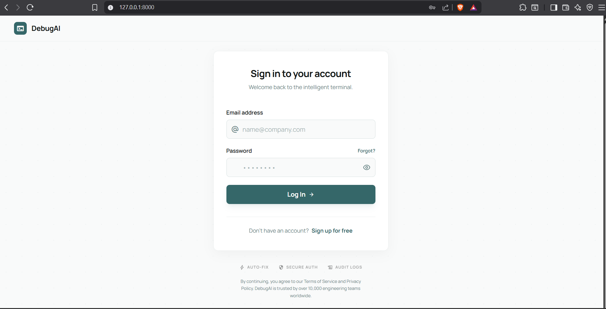
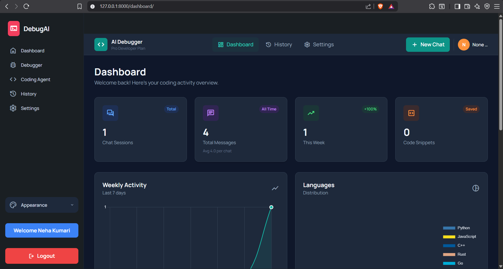
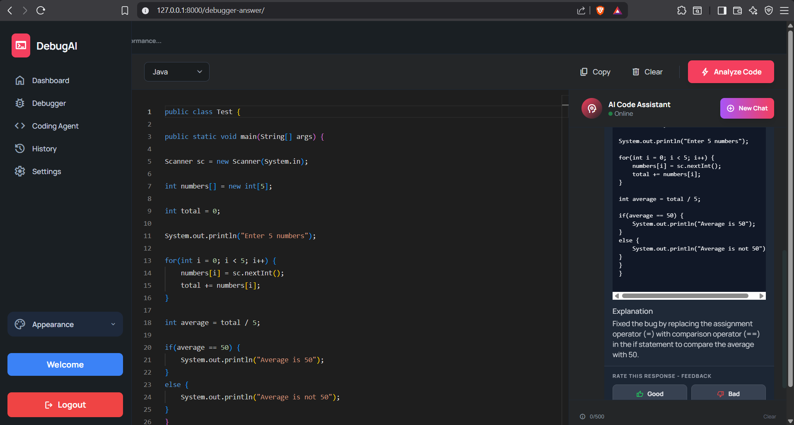
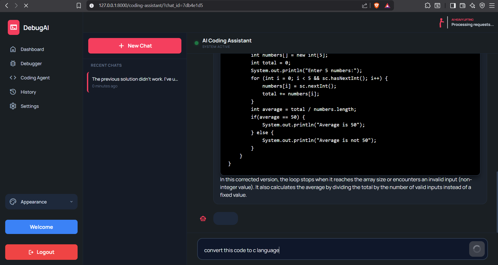
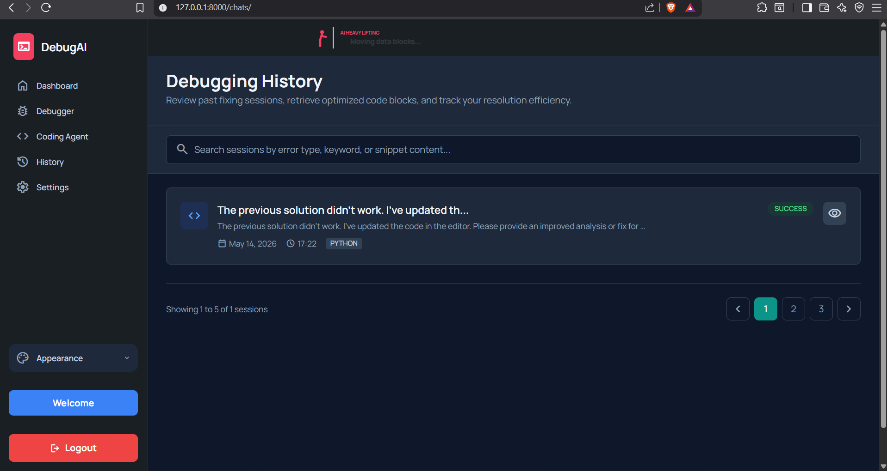
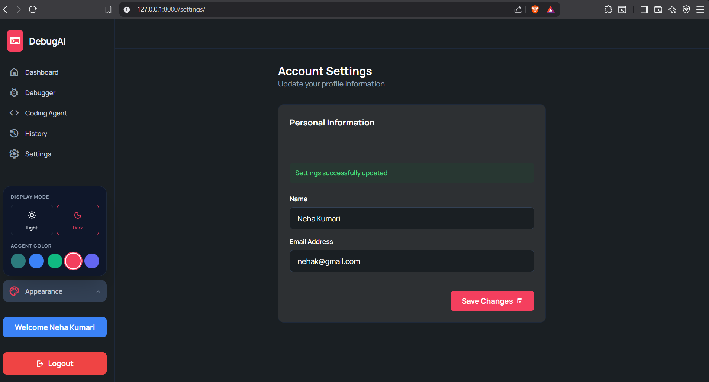
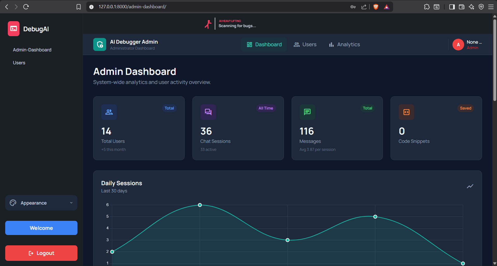
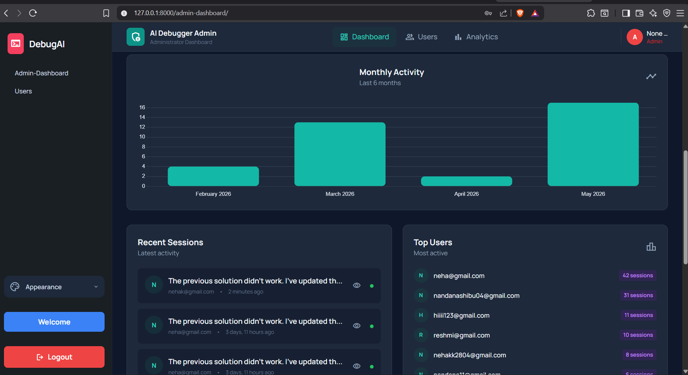
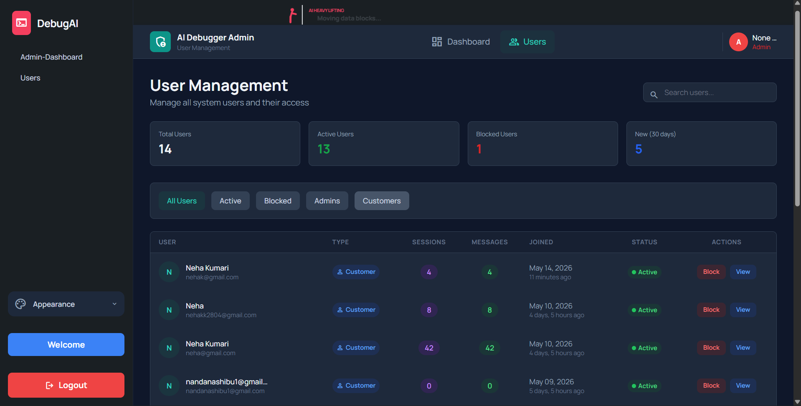

# AI-Powered Self Healing Code Debugger

An AI-powered Django web application that helps developers analyze, debug, and optimize code efficiently through an intelligent debugging assistant and interactive dashboard system.


## Features

- AI-powered code debugging 
- Interactive coding assistant chat system
- User and Admin dashboards
- Analytics and activity tracking
- AI-generated debugging explanations
- User management system
- Debugging history tracking
- User profile & appearance settings
- Authentication system
- Modern dark-themed responsive UI

# Project Screenshots

## Sign up Page



## User Dashboard



## Debugger Page



## AI Coding Assistant



## Debugging History



## Settings Page



## Admin Dashboard





## User Management



# Tech Stack

- Python
- Django
- HTML5
- CSS3
- JavaScript
- Bootstrap / Tailwind CSS
- SQLite
- Ollama
- Mistral
- Illama

# Installation

Clone the repository:

```bash
git clone https://github.com/Nehakk28/Ai-Powered-Self-Healing-Code-Debugger.git
```

Move into the project directory:

```bash
cd ai_debuger
```

Install dependencies:

```bash
pip install -r requirements.txt
```

Run migrations:

```bash
python manage.py migrate
```

Start the development server:

```bash
python manage.py runserver
```

Open in browser:

```bash
http://127.0.0.1:8000/
```

# Project Modules

- Authentication System
- AI Debugger Engine
- Coding Assistant
- User Dashboard
- Admin Dashboard
- Analytics System
- Session History
- User Management
- Settings & Appearance


